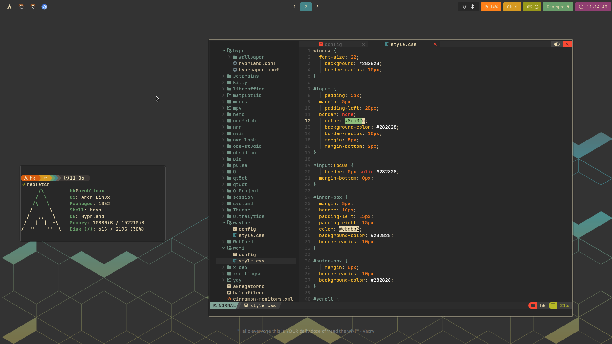

## Archlinux + Hyprland Gruvbox Customization



### Defaults
- terminal : [kitty](https://github.com/kovidgoyal/kitty)
- file manager : [Thunar](https://archlinux.org/packages/?name=thunar)
- menu : [wofi](https://archlinux.org/packages/extra/x86_64/wofi/)
- bar : [waybar](https://github.com/crazzyfingers/waybar-hyprland)
- browser : [chromium](https://archlinux.org/packages/extra/x86_64/chromium/)
- wallpaper : [hyprpaper](https://github.com/hyprwm/hyprpaper)

### Hyprland
```
sudo pacman -S hyprland
```
### 


### Essentials
- [cava](https://github.com/karlstav/cava) : audio visualizer
- [zathura](https://github.com/pwmt/zathura) : document viewer
- [nnn](https://github.com/jarun/nnn) : terminal file manager
- [obsidian](https://archlinux.org/packages/extra/x86_64/obsidian/) : knowledge management
- [hyprshot](https://github.com/Gustash/hyprshot) : screenshot
- [neofetch](https://github.com/dylanaraps/neofetch) : command line system information
- [swappy](https://github.com/jtheoof/swappy) : snapshot editing
- [btop](https://github.com/aristocratos/btop) : system monitoring

- Icon Theme : [Fluent Dark](https://github.com/vinceliuice/Fluent-gtk-theme)
